# SparkQ Workflow Diagrams

> Visual diagrams showing how SparkQ components interact and data flows through the system.

---

## Table of Contents

1. [System Overview](#system-overview)
2. [Task Lifecycle](#task-lifecycle)
3. [Request Flow](#request-flow)
4. [Queue Runner Workflow](#queue-runner-workflow)
5. [Stale Task Detection](#stale-task-detection)
6. [Session & Queue Hierarchy](#session--queue-hierarchy)
7. [Configuration Loading](#configuration-loading)
8. [UI Component Architecture](#ui-component-architecture)

---

## System Overview

### High-Level Component Diagram

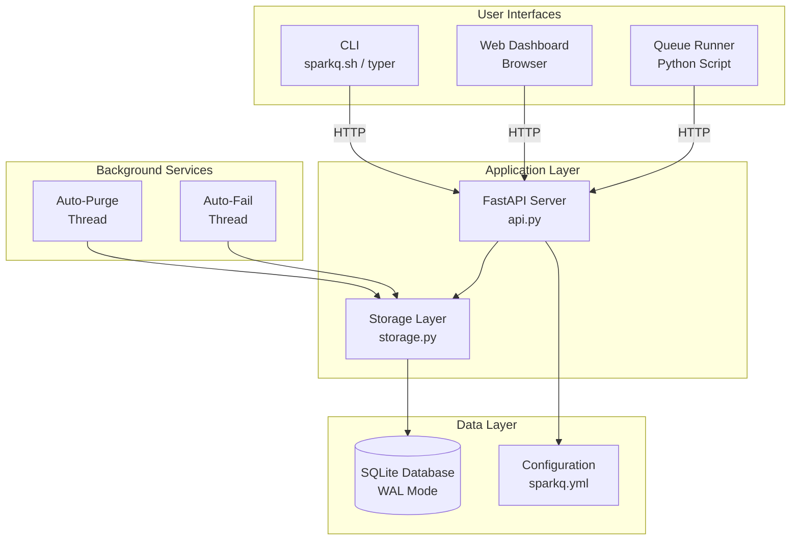

### Server Startup Sequence

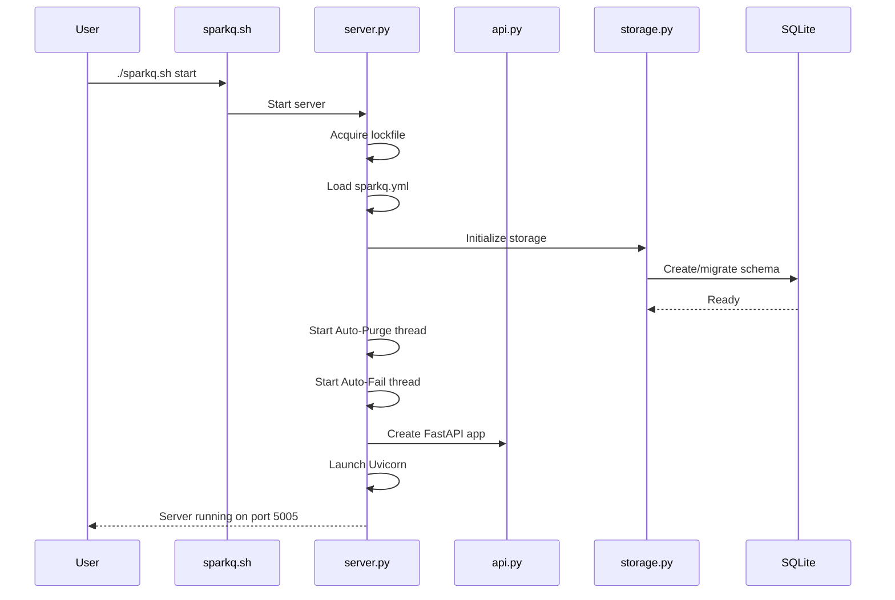

---

## Task Lifecycle

### Complete Task Flow

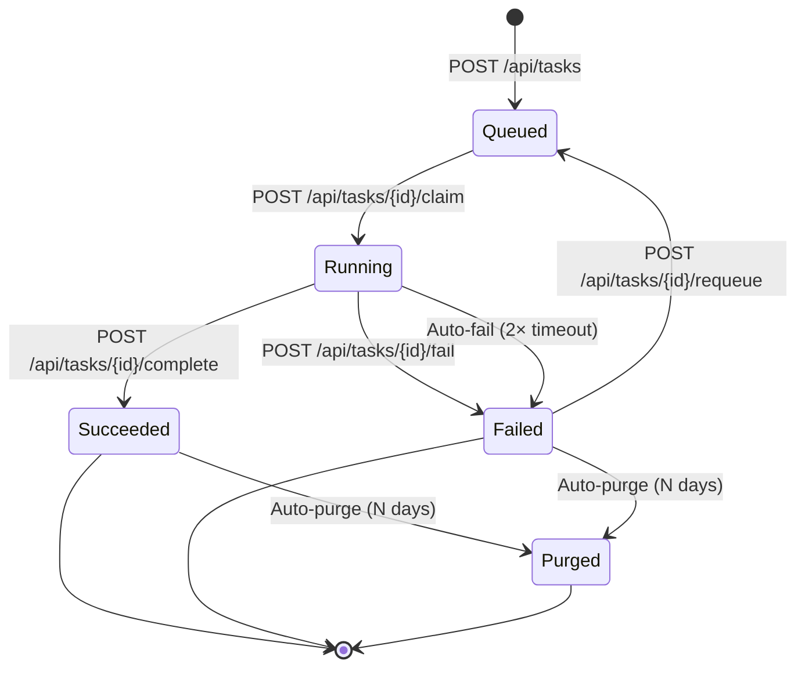

### Task State Transitions

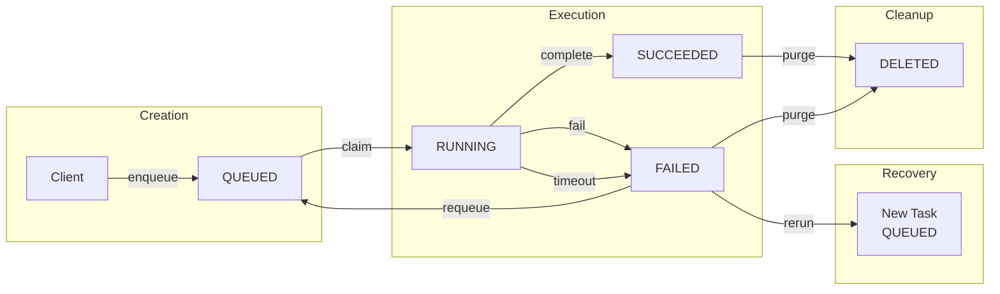

---

## Request Flow

### API Request Processing

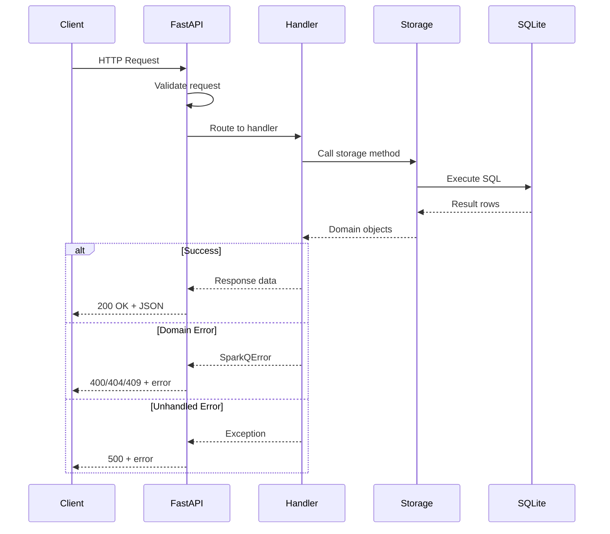

### Task Creation Flow

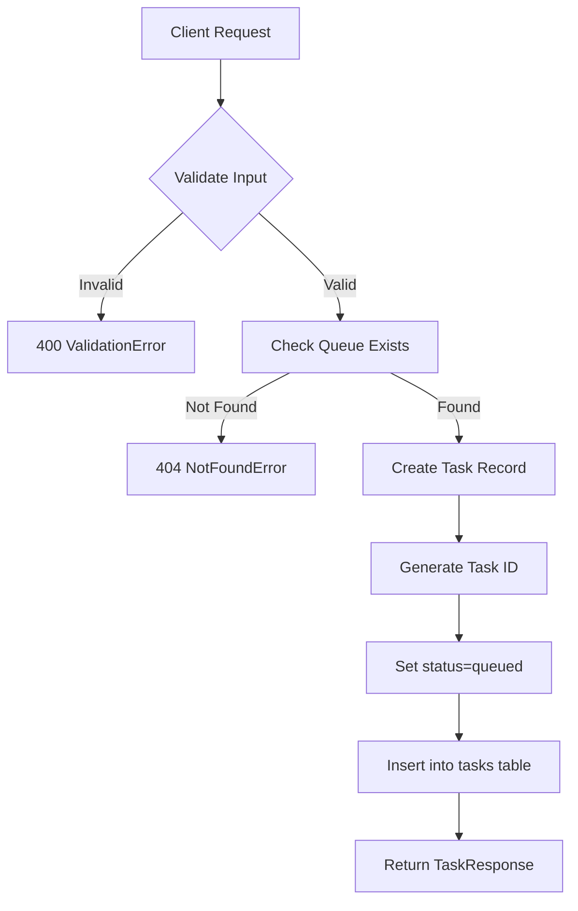

---

## Queue Runner Workflow

### Continuous Polling Mode

```mermaid
flowchart TD
    A[Start Queue Runner] --> B[Load Configuration]
    B --> C[Resolve Base URL]
    C --> D{Poll Loop}

    D --> E[GET /api/tasks<br/>queue_id=X, status=queued]
    E --> F{Tasks Found?}

    F -->|No| G[Sleep poll_interval]
    G --> D

    F -->|Yes| H[Select First Task]
    H --> I[POST /api/tasks/{id}/claim]
    I --> J[Stream Prompt to stdout]
    J --> K[Wait for Execution]
    K --> L{Success?}

    L -->|Yes| M[POST /api/tasks/{id}/complete]
    L -->|No| N[POST /api/tasks/{id}/fail]

    M --> D
    N --> D
```

### Task Execution Sequence

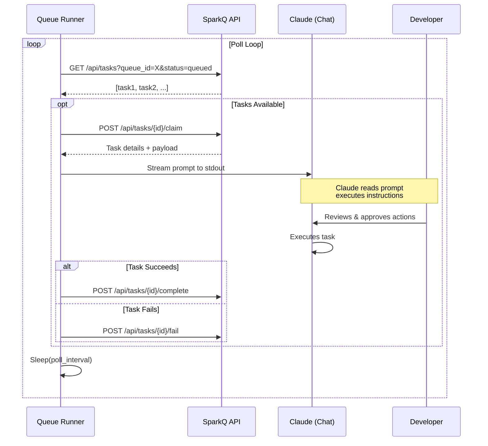

---

## Stale Task Detection

### Auto-Fail Flow

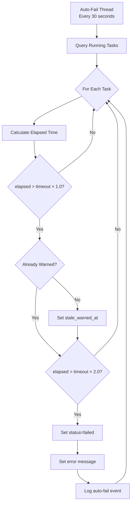

### Timeout Thresholds

```mermaid
gantt
    title Task Timeout Timeline
    dateFormat X
    axisFormat %s

    section Task Execution
    Active Execution        :a1, 0, 600

    section Warnings
    Warning Threshold (1×)  :milestone, m1, 600, 0

    section Auto-Fail
    Grace Period            :a2, 600, 1200
    Auto-Fail (2×)          :milestone, m2, 1200, 0
```

---

## Session & Queue Hierarchy

### Entity Relationships

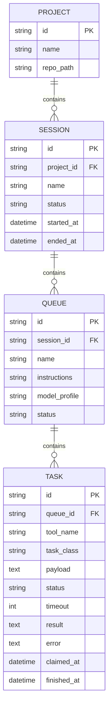

### Status Flow

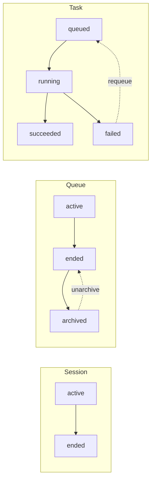

---

## Configuration Loading

### Resolution Chain

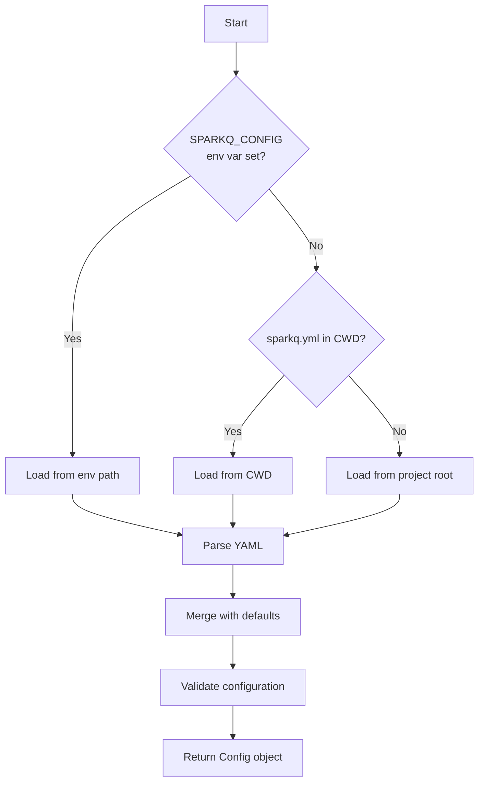

### Configuration Structure

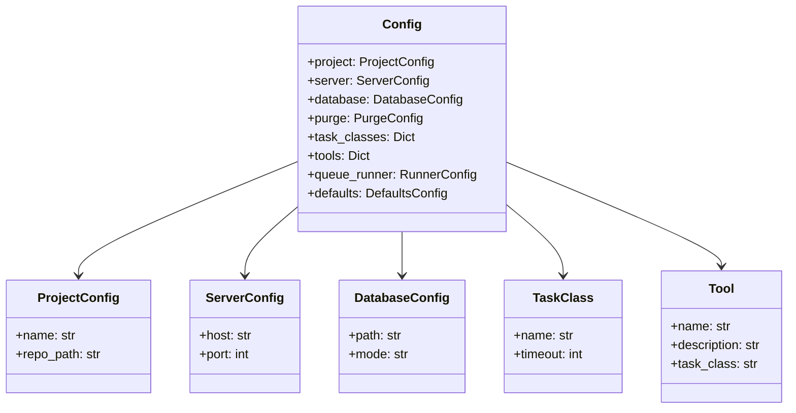

---

## UI Component Architecture

### Page Navigation

```mermaid
flowchart TD
    subgraph "Router (app-core.js)"
        A[URL Change] --> B{Parse Route}
        B --> C[/dashboard]
        B --> D[/settings]
        B --> E[Legacy Routes]

        E --> F[Redirect to new route]

        C --> G[Show Dashboard Page]
        D --> H[Show Settings Page]
    end

    subgraph "Pages"
        G --> I[dashboard.js]
        H --> J[config.js]
    end

    subgraph "Components"
        I --> K[quick-add.js]
        I --> L[Stat Cards]
        I --> M[Task List]
    end
```

### Module Dependencies

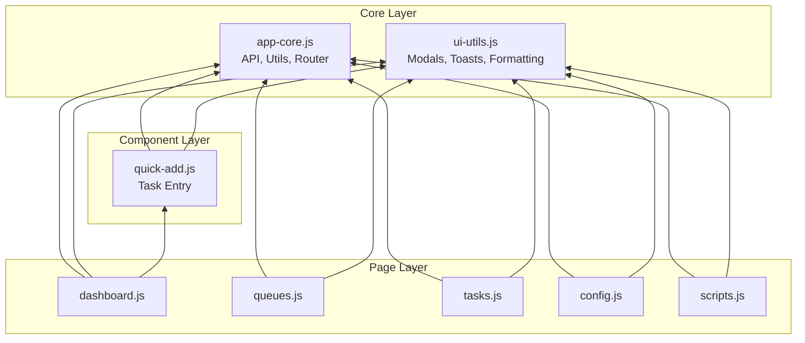

### Event Flow

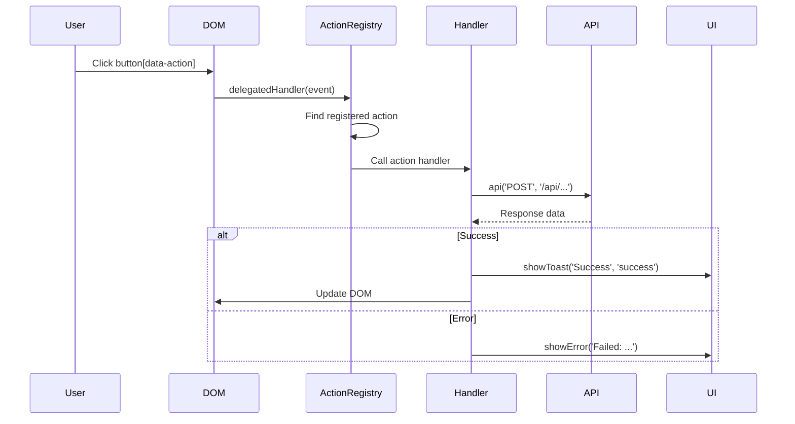

---

## Data Flow Summary

### Complete System Flow

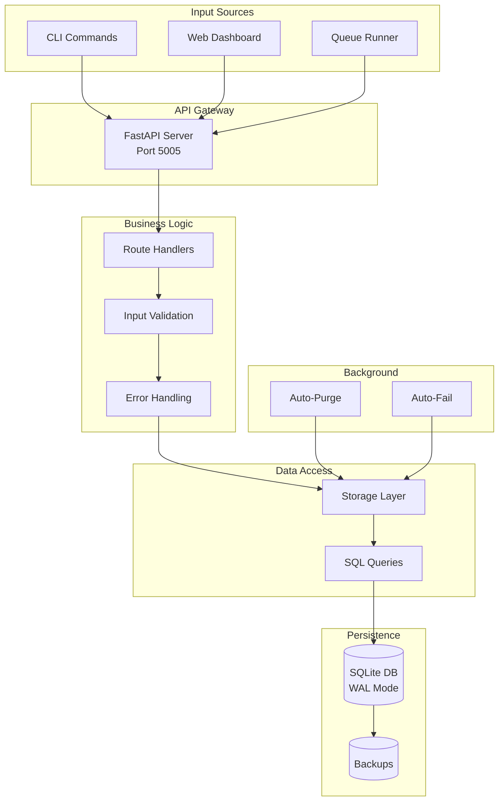

---

## Quick Reference

### Status Values

| Entity | Valid Statuses |
|--------|----------------|
| Session | `active`, `ended` |
| Queue | `active`, `ended`, `archived` |
| Task | `queued`, `running`, `succeeded`, `failed` |

### Timeout Classes

| Class | Default Timeout | Use Case |
|-------|-----------------|----------|
| `FAST_SCRIPT` | 120s | Quick scripts |
| `MEDIUM_SCRIPT` | 600s | Standard scripts |
| `LLM_LITE` | 480s | Haiku, simple prompts |
| `LLM_HEAVY` | 1200s | Sonnet, complex tasks |

### API Endpoints by Category

| Category | Methods | Base Path |
|----------|---------|-----------|
| Health | GET | `/health` |
| Sessions | GET, POST, PUT, DELETE | `/api/sessions` |
| Queues | GET, POST, PUT, DELETE | `/api/queues` |
| Tasks | GET, POST, PUT, DELETE | `/api/tasks` |
| Config | GET, POST | `/api/config` |
| Tools | GET, POST, PUT, DELETE | `/api/tools` |
| Prompts | GET, POST, PUT, DELETE | `/api/prompts` |

---

*These diagrams use [Mermaid](https://mermaid.js.org/) syntax and render automatically on GitHub.*
